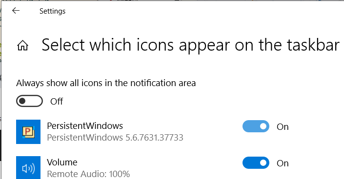

## PersistentWindows quick help
* How to use snapshot feature
  1. In taskbar settings, turn on PW to let the icon always appear on taskbar
  
  2. Shortcut for snapshot command

  | Snapshot command | Shortcut|
  | --- | --- |
  | Capture snapshot 0 | Double click PW icon
  | Restore snapshot 0 | Click PW icon
  | Capture snapshot N | Shift click PW icon N times (N = 1, 2, 3)
  | Restore snapshot N |  Ctrl click PW icon N times
  | Capture snapshot X (release 5.12) | Double click PW icon then immediately press key X (X represents a digit [0-9] or a letter [a-z])
  | Restore snapshot X (release 5.12) | Click PW icon then immediately press key X
  | Undo last snapshot restore | Alt click PW icon


* PW command line options
  | Command line option | Meaning |
  | --- | --- |
  | -splash=0       | No splash window at PW startup
  | -notification=1 | Turn on balloon tip and sound notification when restoring windows
  | -delay_start \<seconds\> | Delay PW invoked from auto startup memu by specified seconds
  | -redraw_desktop | redraw whole desktop windows after restore
  | -prompt_session_restore | Upon resuming last session, ask user before restore window layout, this may help to reduce total restore time for remote desktop session on slow internet connection.
  | -fix_zorder=1   | Turn on z-order fix for automatic restore
  | -redirect_appdata | Use current dir instead of user appdata dir to store database file, this option allows launching second PW instance.
  | -check_upgrade=0 | Disable version upgrade check from beginning 

* Run PW with customized icon (since version 5.11)
  * Rename your customized icon file as pwIcon.ico and copy it to 'C:/Users/\<YOUR_ID>/AppData/Local/PersistentWindows/', or copy it to current directory if running (second inst of) PW with -redirect_appdata switch from command console.
  * Add second icon file, rename it to pwIconBusy.ico, this icon is displayed when PW is busy restoring windows.
```